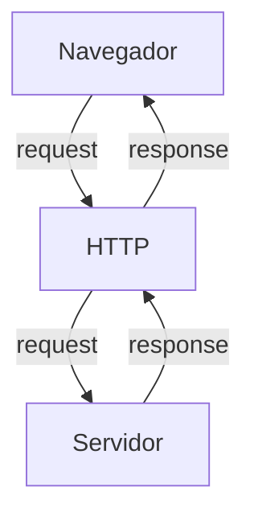
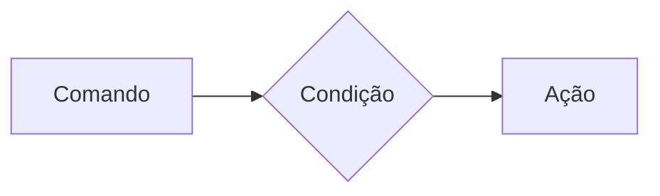
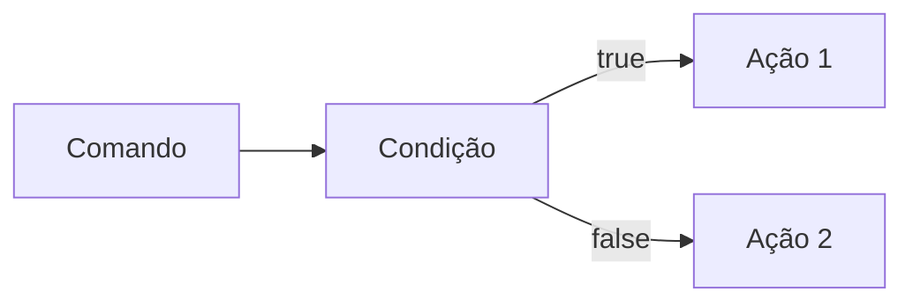
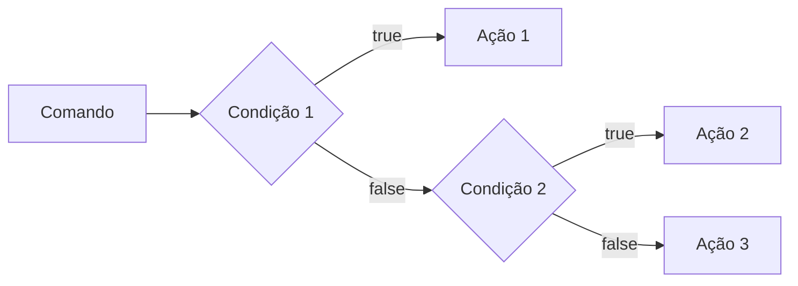
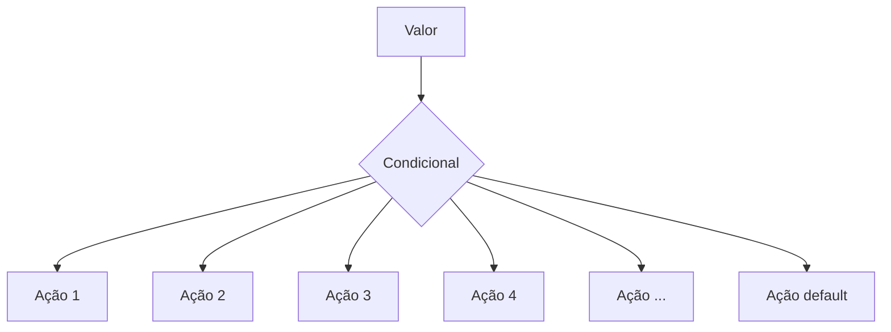
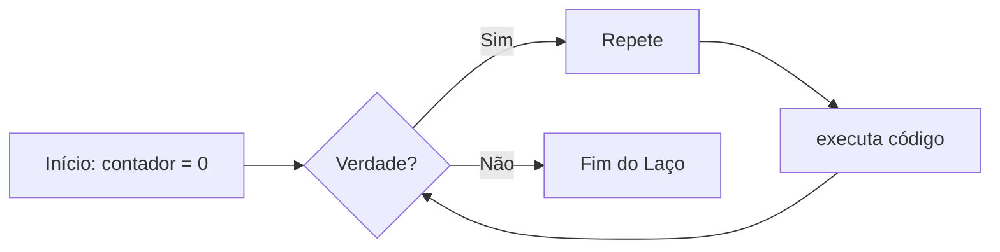
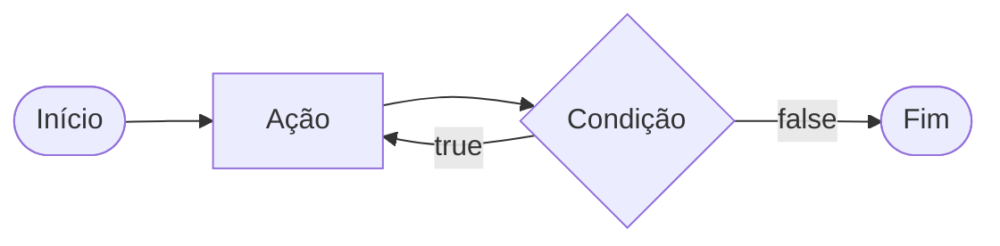
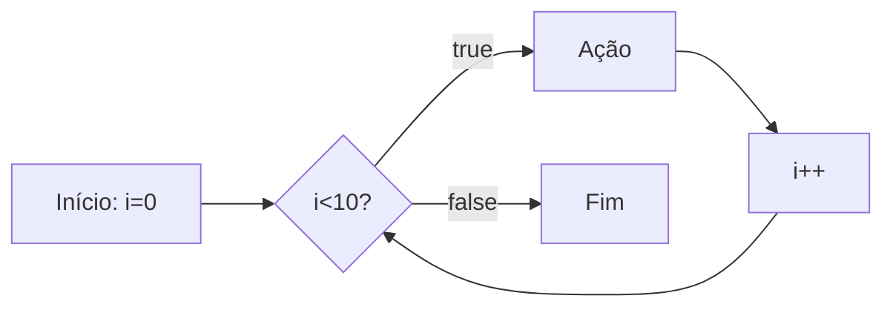

# Curso BackEnd - 225h - Técnico em Desenvolvimento de Sistemas - SENAI

Profº Diogo TB

Escola SENAI Americana

2º Semestre 2026

## Objetivos do Curso 

- Desenvolver Alicações web Server Side, ultilizando a linguagem PHP;
- Aplicar Sistaxe Nativa PHP (Vanilla);
- Manipulação HTTP;
- Persistência de Dados;
- Seguraça contra SQL Injection/CSRF;
- Refatoração em POO (Programação Orienteda de Objetos);
- Arquitetura MVC (Model, View, Controller);
- Ultilização do Framework Laravel;


# obs:
- Framework - um conjunto de bibliotecas que ofeecem uma solução completa para o desenvolvimento de alguma coisa

## Cronograma do Semestre

Carga Horária: 105h 1º Semestre e 120h 2º Semestre

Duração: 20 Semanas 1º Semestre e 20 Semanas 2º Semestre

### Semana 1: Introdução ao BackEnd e Configuração do Ambiente PHP

### O que é BackEnd? 

O back-end é a aprte de uma aplicação que o usuário não vê, mas que faz tudo funcionar por trás das telas.

O Back-End é a parte de um sistema que funciona nos servidores, sendo responsável por executar a lógica da aplicação, processar informações e armazenar dados. 

Além disso, o BackEnd é responsável por atender ás solicitações do Frontend.

Sobre o mercado atual o cenário é bom, mas mais exigente do que era. Quem conhece só o básico enfrenta mais concorrência. Quem alia backend sólido com IA aplicada, cloud e inglês está num patamar completamente diferente — vagas internacionais remotas são uma realidade pra esse perfil.

O Backend é formado pelo servidor, banco de dados, lógica de programação com APIs e linguagens de programação/frameworks. Esses componentes trabalham juntos para processar dados, armazenar informações e garantir o funcionamento da aplicação.

 Ferramentas usadas para escrever o código do servidor, como Python, Node.js (JavaScript), Java e PHP.APIs: Os "caminhos" que permitem que o que você vê no celular converse com o servidor.

# Para que Serve

-Processar lógica de negócio: regras, cálculos, validações (ex: calcular frete, aplicar desconto, validar login)

-Gerenciar banco de dados: salvar, buscar, atualizar e deletar informações

-Autenticação e autorização: controlar quem pode acessar o quê (login, senhas, permissões)

-Fornecer APIs: criar "pontes" (endpoints) para o frontend ou outros sistemas consumirem dados

-Integração com serviços externos: pagamentos, e-mails, notificações, APIs de terceiros

-Segurança: proteger dados sensíveis, evitar ataques (SQL injection, XSS, etc.)

-Escalabilidade e performance: garantir que o sistema aguente muitos usuários ao mesmo tempo.

#### O Ciclo de Vida da Requisição HTTP

##### O que é HTTP?

*HTTP* , HYypertext Trasnfer Protocol, é um protocolo de comunicação utilizada  para trasferência de informações na www (Worl wide web) e em outros sistemas de redes.

O HTTP é a abase para que o cliente e um servidor web troquem informações Ele permiti a requisição e a resposta de recursos como imagens, arquivos e textos.



#### Como funciona na Prática o Backend

- **Ação do Usuário**: Envia uma Solicitação pela UI (Interface do Usuário). Exemplo de UI: Tela de Celular, Navegador da Internet, Alexa, IOT ...
- **Enviar uma Requisição**: A UI transforma ação do Usuário em uma Requisição HTTP.
- **O Processamentoo BackEnd**: O Código BackEnd recebe o pedido, valida os dados e decide o que fazer. Ex: consultar uma informação no BD(Base de Dados)
- **Resposta**: O servidor delvode o resultado para a UI. Ex: Um login Autorizado, Confirmaçaõ de uma Compra...

### Tipos de Requisição HTTP

Os tipos de requisição HTTP indicam a ação que o usuário deseja executar no servidor. As principais ações são:

- **GET**: Pede dados de um lugar especifico do servidor. "Não faz alterações no servidor"
- **DELETE**: Apaga um Dado no servidor
- **POST**: Envia dados novos para *criar* algo ou processar informações no servidor.
- **PUT/PATCH**: Modificar um dado já existente.
>PUT substitui o objeto inteiro. Você deve enviar todos os dados do registro. O PATCH atualiza apenas o que mudou. Você envia só os campos que quer trocar, sem mexer no resto.

---
### Iniciando o PHP 

*PHP* (Hypertext PreProcessor) é uma linguagem de programação interpretada e open source, focada no desenvolvimento de sistemas para WEB, pode ser usada junto com HTML para criação de páginas WEB dinâmica.

O PHP de fato é uma das linguagens de programação mais populares da atualidade. Ela permite que você crie aplicações web robustas, 
de uma maneira muito simplificada e direta. A linguagem tem diversos recursos que facilitam e aceleram o processo de desenvolvimento de sites e sistemas para a WEB e além do mais, ela ainda tem um ótimo ecossistema, uma excelente comunidade e um grande mercado de trabalho.
---
#### Instalando o PHP

- Fazer o Dowloand do PHP (php.net)
- ZIP - NTS(Non Thread Safe) 8.5
- Descompactar o Arquivo do PHP na pasta C:\asrc\php (Para Descompactar usar o 7Zip = Melhor) => nunca salvar arquivo ou programas na raiz do sistema(C:)
- Adcionar a Pasta do php(C:\src\php) as Variáveis de Ambiente do Sistema (PATH)
- Verificar a instalacão rodando o comando *php --version*

##### Criando Minha Primeira Aplicação em PHP

1. Antes de começar de Codar:
 
- Preparar meu VSCODE
    - Criar um Profile próprio para PHP
    - Instalar Extensões Necessária para Transformar o VSCode em uma IDE:
        - PHP Intelephese => permite a utilização de Snippets(atalhos de Código)
        - PHP Debug => Ajuda a encontar erros de códigos
        - PHP Cs Fixer => Formatação de códigos (Identação)
        - PHP Server => Ajuda na criação de um servidor local PHP
    - Desabilitamos o PHP Nativo do VSCode (@builtin PPHP)

2. Hello World (muito importante)

### Semana 2 - Variáveis, Constantes e Operadores em PHP

##### Estudo de Variáveis e Constantes em PHP

Declarar variáveis é alocar um espaço na memória que permite a inclusão e manipulação de dados

**Variáveis**

- devem ser declaradas usando "$" antes do nome da variável
- são não tipadas ( não precisa declara o tipo dela na criação)
- podem ser String, Numéricas ( interger e float ), Booleanas e Nulas. Não permite declaração de Undefined
- usar o declare(strict_types=1); na primeria linha do arquivos; => Blinda o sistema contra conflitos de tipos de variáveis 

**Constantes** 

- não podem ser mudadas ou redeclaradas após a criação 
- pode ser criada usando o "const" ou "define"
- não permite interpolação 

##### Estudo de Operadores

**Aritméticos**: são usados para realizar cálculos.
  |Operador | Nome | Exemplo | Resultado |
  |-|-|-|-| 
  | + | Adição | 10 + 5 | 15 |
  | - | Subtração | 10 - 5 | 5 |
  | * | Multiplicação | 10 * 5 | 50 |
  | / | Divisão | 10 / 5 | 2 |
  | % | Modulo(Resto) | 10 % 3 | 1 (10 dividido 3 da 3, sobra 1) |
  | ** | Expoente | 2 ** 3 | 8 (2 elevado a 3) |

obs: o Operador % é o melhor amigo de um programador, prmite ordenar listas e organizar fila e pilhas

**Relacionais**: Permite o Relacionamento entre dois ou mais valores, o resultado de uma operação é sempre uma booleana (verdadeiro ou falso).

| Operador | Significado | Exemplo | Resultado | 
| - | - | - | - | 
| > | Maior que | 18 > 18 | false |
| >= | Maior ou igual a | 18 >= 18 | true |
| < | Menor que | 10 < 20 | true |
| <= | Menor ou igual a | 10 <=5 | false
| == | Comparação de Valor | "10"==10 | true | 
| === | Comparação Estrita | "10"===10 | false |
| != | Diferente | "10"!=10 | false |
| !== | Estritamente Diferente | "10"!==10 | true |


**Lógicos**: Permite a Combinação entre sentenças. 

- Operador AND (E) => && : para o resultado ser verdadeiro, todas as combinações precisam ser verdadeiras
  - true && true => true
  - true && false => false

- Operador OR (OU) => || : para o resultado ser verdadeiro, Basta apenas uma condição ser verdadeira
    - false || true => true
    - false || false => false

- Operador NOT (Não) => ! : Inverte a lógica da Operação, 
    - !true => false
    - !false => true

---

### Semana 3 - Estrutura de Controle de Dados (Condicionais e Repetição)

- **Conteúdo**: Estrutura `if`, `else`,`eslseif`, operadores ternários, `match` => 
substituto do `swith/case`, loops `for`, `while` ,  `do-while` e `foreach`

#### Estruturas de Controle da Dados Ajudam no Processo de Automatização em Programas e Sistemas

##### Condicionais (IR, ELSE, ELSEIF)

**Formas de Uso**

- uso do `if` apenas:
Exemplo: aplicar desconto de 10% em compras acima de 100 Reais;



```php

if($valorCompra > 100){
    $valorFinal = $valorCompra * 0.9;
}

```

- Uso do `if` e do `else`
Exemplo: Aplicar um desconto de 10% para compras acima de 100reais e 5% para as demais compras



```php

if($valorCompra > 100){
    $valorFinal = $valorCompra * 0.9;
} else {
    $valorFinal = $valorCompra * 0.95;
}

```

- Uso `elseif` (If Encadeado) => estrutura usada para manipulação de dados em duas ou mais condicionais
Exemplo: Compras acima de 200 reais tem 15% de desconto, compras acima de 100 reais de 10% de desconto e demais compras tem 5% de desconto 



```php


if($valorCompra > 200) {
    $valorFinal = $valorCompra * 0.85;
} elseif ($valorCompra > 100) {
    $valorFinal = $valorCompra * 0.9;
} else {
    $valorFinal = $valorCompra * 0.95;
}

```

*obs*: sempre usar `elseif` para situações que precisam de mais de uma condição, ou seja, fazer encadeamento das condições

- Uso *ERRADO* do if


```php 

if($valorCompra > 200) {
    $valorFinal = $valorCompra * 0.85;
}
if($valorCompra > 100) {
    $valorFinal = $valorCompra * 0.9;
} else {
    $valorFinal = $valorCompra * 0.95;
}

```

##### Operadores Ternários

Um atalho para a estrutura condicional `if/else`, normalmente escrito em uma única linha de código.

` condição ? verdadeira : falsa `

Perfeito para decisões curtas de uma linha de comando 
Exemplo: Verificar se a pessoa é maior de idade (18);

```php

$idade = 20;
//O formato é (Condição) ? Verdadeiro : Falso;

$status - ($iade>=18) ? "Maior de idade" : "Menor de idade";
$status2 = ($idade>=60) ? "Idoso" : ($idade>=18) ? "Adulto" : "Criança" ;

echo $status //

```
##### Expressão Condicional `match` (PHP 8)

No mercado atual de PHP, não se uma mais uma `Switch/Case` para chegar valores fixos, usa-se o `match`. Ele compara um valor e retorna diretamente o resultado caso atenda a condição.




Exemplo: Selecionar o Dia da Semana a partir de um Nº 

```php

$diaSemanaNum = date("W"); // pega o Dia da Semana em formato mumério

$nomeDiaSemana = match($diaSemanaNum) {
    "0" => "Domingo",
    "1" => "Segunda",
    "2" => "Terça",
    "3" => "Quarta",
    "4" => "Quinta",
    "5" => "Sexta",
    "6" => "Sábado",
    "default" => "Dia Inválido"
};

echo "Hoje é : $nomeDiaSemana";

```
##### Laços de Repetição

Um laço de repetição faz com que um bloco de código rode várias vezes até que uma condição mande parar. 

- O Laço while (Enquanto)

Ele verifica se a condição é verdadeira ANTES de entrar no laço. Ideal quando você não sabe exatamente quantas vezes vai rodar o laço. 


Exemplo de Aplicação do White: jogo de adivinhação de um nº Secreto

```php

$numeroSecreto = rand(1,10);

$tentativas = 0;

$numeroEscolhido = 0;

while(numeroEscolhido != numeroSecreto){
    echo "Tente Novamente"
    //vou escolher outro Nº para adivinhar
    numeroEscolhido = rand(1,10);
    tentativas++;
}

echo "Acertou Miseravi!!! o nº secreto é $numeroEscolhido";

```

- O laço `do-while` (Faça - Enquanto)

A diferença é que ele executa o bloco pelo menos uma vez, mesmo que a condição seja false desde o início, pois ele só pergunta no final.




Exemplo: Jogo de Adivinhação de um nº

```php

do{
    $numeroEscolhido = rand(1,10);

    if(numeroEscolhido == numeroSecreto){
        echo "Parabéns, Acertou!!!";
        break;
    }
    echo "Tente Novamente!!!";

} while(numeroEscolhido != numeroSecreto);

```

#### O Freio de Emergência: `break` e `continue`

As vezes precisamos interferir no laço enquanto ele está rodando

- `break` => **Para Tudo!** Quebra o laço interiro  e avai embora 
- `continue` => **Pula a rodada!** Ele ignora o código daquela rodada especifica e pula logo par a próxima repetição.

Exemplo de Aplicação do Código: Sistema de Controle do Elevador

```php 

for($andar = 1 ; $andar<=10; $andar++){
    if($andar ==4){
        echo "Andar $andar está em obras. Passando direto!";
        continue;
    }

    echo "Elevador parou no andar $andar"
}
```
---
##### Laço de Repetição 

Use o `for`quando você sabe quantas vezes precisa repetir uma ação ou quando precisa controle um contador. Ele possui três partes:

- inicialização,
- condição,
- incremento;

for(inicialização; condição; incremento){}


Exemplo: Exibir todos os meses do Ano

```php
for($mes=1; $mes<=12; $mes++){
    echo "Mês $mes";
}
```
Nesse Exemplo, `$mes` começa em 1, o laço continua enquanto 
`$mes`for menor ou igual a 12 e, ao final de cada repetição, `$mes++`aumenta o contador em 1.

##### Laço de Repetição `foreach`´

Use o `foreach` quando precisar percorrer cada item de um **array*. Ele acessa os elementos diretamente, sem que você precise controlar o contador.

Exemplo: Imprimir todos os itens de um vetor 

```php

$frutas =[$frutas as $fruta]{
    echo "Fruta: $fruta";
}
```
Outro Exemplo: Acessar a chave e o valor de cada item:

```php 

$precos = [
    "Caderno" => 25.90,
    "Caneta" => 5.50,
    "Mochila" => 99.00
]; // vetor não ordenado chave => valor

foreach ($preco as $produto =>$preco){
    echo"$produto: R$number_format($preco,2)";
}
```
---
---

### Semana 4 - Modularização com Funções

#### Principio do DRY ( `Dont´t Repeat) Yourself`)

Se uma lógia foi escrita duas vezes ou mais dentro de um código, essa lógica deve virar uma função.

#### Funções Nativas do PHP

O PHP tem milhares de funções prontas, essas funções são chamadas de nativas.

- **O que é uma função?**

Uma funçao é como uma máquina: você coloca uma máteria-prima(Parâmetro), ela processa e devolve um produto final(Retorno)

Exemplo de Função Nativa:

```php

$texto = "senai americana";

//str_replace(le abusca de um pedaço do texto e substítui por outro)
$textoNovo = str_replace("Americana","São Paulo",$texto);

//strtoupper
echo strtoupper($textoNovo); // SENAI SÃO PAULO 
```

##### Principais Funções Nativas ( Mais Ultilizados )

As funções abaixo já fazem parte do PHP e podem ser chamadas diretamente no código. Observe os parâmetros que cada uma recebe e o tipo de informação que ela retorna.

| Função | Categoria | O que faz | Como usar |
|---|---|---|---|
| `strlen()` | Strings | Retorna a quantidade de caracteres de um texto. | `$tamanho = strlen($texto);` |
| `strtoupper()` | Strings | Converte o texto para letras maiúsculas. | `$resultado = strtoupper($texto);` |
| `strtolower()` | Strings | Converte o texto para letras minúsculas. | `$resultado = strtolower($texto);` |
| `ucfirst()` | Strings | Converte a primeira letra do texto para maiúscula. | `$resultado = ucfirst($texto);` |
| `trim()` | Strings | Remove espaços e quebras de linha no início e no fim do texto. | `$limpo = trim($texto);` |
| `str_replace()` | Strings | Substitui uma parte do texto por outra. | `$novo = str_replace("-", "", $cpf);` |
| `substr()` | Strings | Extrai uma parte do texto a partir de uma posição. | `$inicio = substr($texto, 0, 3);` |
| `explode()` | Strings | Divide um texto e cria um array usando um separador. | `$palavras = explode(" ", $nome);` |
| `implode()` | Arrays | Junta os itens de um array em um único texto. | `$lista = implode(", ", $nomes);` |
| `count()` | Arrays | Conta a quantidade de itens de um array. | `$total = count($produtos);` |
| `in_array()` | Arrays | Verifica se um valor existe dentro de um array. | `$existe = in_array("SP", $estados, true);` |
| `array_push()` | Arrays | Adiciona um ou mais itens ao final de um array. | `array_push($nomes, "Ana");` |
| `array_pop()` | Arrays | Remove e retorna o último item de um array. | `$ultimo = array_pop($nomes);` |
| `sort()` | Arrays | Ordena um array em ordem crescente e reorganiza suas chaves. | `sort($notas);` |
| `array_keys()` | Arrays | Retorna um array contendo as chaves de outro array. | `$chaves = array_keys($produtos);` |
| `number_format()` | Números | Formata um número com casas decimais e separadores definidos. | `$preco = number_format($valor, 2, ',', '.');` |
| `round()` | Números | Arredonda um número para a quantidade de casas informada. | `$media = round($nota, 2);` |
| `max()` | Números | Retorna o maior valor de uma lista ou array. | `$maior = max($notas);` |
| `min()` | Números | Retorna o menor valor de uma lista ou array. | `$menor = min($notas);` |
| `is_numeric()` | Validação | Verifica se o valor é um número ou uma string numérica. | `if (is_numeric($entrada)) { ... }` |
| `isset()` | Validação | Verifica se uma variável existe e não possui valor `null`. | `if (isset($usuario)) { ... }` |
| `empty()` | Validação | Verifica se uma variável está vazia. | `if (empty($pedido)) { ... }` |
| `date()` | Data e hora | Formata uma data ou hora conforme uma máscara. | `$hoje = date('d/m/Y');` |
| `file_exists()` | Arquivos | Verifica se um arquivo ou diretório existe. | `if (file_exists('dados.txt')) { ... }` |
| `file_get_contents()` | Arquivos | Lê todo o conteúdo de um arquivo ou endereço. | `$conteudo = file_get_contents('dados.txt');` |
| `file_put_contents()` | Arquivos | Grava conteúdo em um arquivo, criando-o se necessário. | `file_put_contents('log.txt', $mensagem);` |

**Atenção:** algumas funções modificam o array original, como `sort()`, `array_push()` e `array_pop()`. Já outras retornam um novo valor, como `count()`, `explode()` e `str_replace()`. Em caso de dúvida, consulte a documentação oficial do PHP e verifique o retorno da função.

##### Documentação PHP

[Acesse a documentação oficial do PHP em Português](https://www.php.net/manual/pt_BR/)

Consulte também a [referência de funções do PHP](https://www.php.net/manual/pt_BR/funcref.php) para pesquisar a sintaxe, os parâmetros eos valores por cada função.

#### Funções Customizadas (Criando suas próprias máquinas)

uando o PHP não tem a função que queremos, nós a criamos!

**A Regra de Ouro:** Uma função deve focar em `return`(retornar um valor), e não imprimir (`echo`).

Veja a diferença nesse exemplo:
```php

function calcularTotal($preco, $quantidade){
    //a função calcula e rotna o resultado, mas não imprime nada
    return $preco * $quantidade;
}

$total = calcularTotal(25.00, 3);

echo "Total da compra: R$ " . number_format($total, 2, ",", ".");
// Total da compra: R$ 75,00


```
A função `calculatTotal()` pode ser reutilizada em uma página, relatório ou teste. O `echo` aparece somente fora da função, no momento de apresentar o resultado ao usuário.

##### Padrão de Uso Corporativo (PHP 8 Strict Types)

No mercado de trabalho, exigimos que a função avise exatamente o **TIPO** de dado que ela espera receber e o **TIPO** que ela vai devolver.

Isso é chamado de **tipagem de funções**. Ao declarar os tipos, o código fica mais fácil de entender e o PHP consegue indentificar alguns erros antes que eles causem problemas maiores no sistema.

Os tipos mais usados:

* `int`: número inteiro, `10` ou `1024`.
* `float`: número decimal ou ponto flutuante, `10.50`.
* `string`: texto, como `"Maria"`
* `bool`> valor lógico, `true` ou `false`.
* `void`: identifica que a função não devolve nenhum valor.

O tipo deve ser escrito antes do nome de cada parâmetro e o tipo da função deve ser escrito após os parânteses, precedito por `:`, informando o que a função vai devolver.

Exemplo de uso:

```php
function apresentarProdutos(string $nome, float $preço): string{
    return "$nome cuta R$ $preco";
}

$mensagem = apresentaproduto("Caderno", 25.90);
echo $mensagem;
// Caderno custa R$ 25.90

```

> **Resumo**: os tipos dos parâmetros documetam as entradas da função, o tipo após `:` documeta a saída da função

##### O Tipo Mágio :`void`

Se uma função faz um trabalho interno e **não retorna NADA**, dizemos que o retorno dela é "vazio"(`void`).

Exemplo de função sem retorno:

```php
function registroLog(string $mensagem): void{
    //apenas salvar em um arquivo de texto, não devolver nenhuma variável
    file_put_contents("erro.log",$mensagem);
}
```

#### Escopo e Referênciaa (O segredo da memória)

##### O que é Escopo? (A Regra de Las Vegas)

*O que acontece dentro da função, fica dentro da função*. Uma variável criada fora não existe lá dentro, e uma criada lá dentro morre quando a função acaba.

**Escopo**  é o local do programa onde a variável pode ser armazenada/acessada. Em PHP, uma variável criada fora de uma função pertende ao **escopo global**. uma variável criada dentro de uma função pertence ao **escopo local**.

Exemplo de Escopo de variável:


```php 
$nomeSistema = "CRM Senai"; //Variável global

function criarMensagem():string{
    $mensagem = "Bem-Vindo!"; //Variável local
    return $mensagem;
}

echo $nomeSistema; //Correto: esta no escopo global
echo criarMensagem(); //Correto: a função devolve sua variável local.
echo $mensagem; // Incorreto: $mensagem só existe dentro da função, não é acessada fora
```

* Como enviar dados para um função?

A forma mais segura e organizada é enviar os dados por **parâmetros**. Assim, a função não precisa acessar diretamento variáveis globais:

```php
function saudar(string $nome):string{
    return "Olá, $nome!";
}

$nomeCliente = "João";
echo saudar($nomeCliente); // Olá, João!
```

Nesse caso, `$nomeCliente` continua no escopo global, mas seu valor é enviado para o parâmetro local `$nome`. A função recebe uma informação, processa e retorna o resultado.

Exemplo Incorreto:

```php
$nome =- "João";
function saudar():string{
    return "Olá, $nome";
}
```

A função `saudar()`não conhece a variável globla `$nome`

> **Resumo:** variáveis protegem os dados internos da função; parâmetros são o caminho recomendado para evitar Erros e enviar Informações, e `return`é usado para devolver um resultado ao código que chamou a função.


