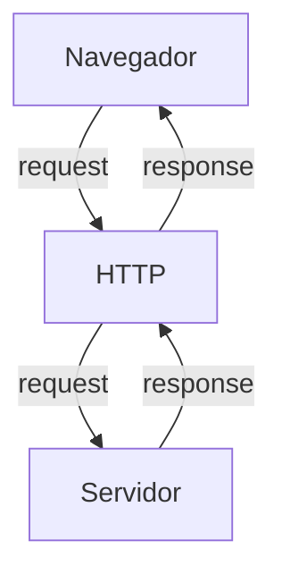

# Curso BackEnd - 225h - Técnico em Desenvolvimento de Sistemas - SENAI

Profº Diogo TB

Escola SENAI Americana

2º Semestre 2026

## Objetivos do Curso 

- Desenvolver Alicações web Server Side, ultilizando a linguagem PHP;
- Aplicar Sistaxe Nativa PHP (Vanilla);
- Manipulação HTTP;
- Persistência de Dados;
- Seguraça contra SQL Injection/CSRF;
- Refatoração em POO (Programação Orienteda de Objetos);
- Arquitetura MVC (Model, View, Controller);
- Ultilização do Framework Laravel;

# obs:
- Framework - um conjunto de bibliotecas que ofeecem uma solução completa para o desenvolvimento de alguma coisa

## Cronograma do Semestre

Carga Horária: 105h 1º Semestre e 120h 2º Semestre

Duração: 20 Semanas 1º Semestre e 20 Semanas 2º Semestre

### Semana 1: Introdução ao BackEnd e Configuração do Ambiente PHP

### O que é BackEnd? 

O back-end é a aprte de uma aplicação que o usuário não vê, mas que faz tudo funcionar por trás das telas.

O Back-End é a parte de um sistema que funciona nos servidores, sendo responsável por executar a lógica da aplicação, processar informações e armazenar dados. 

Além disso, o BackEnd é responsável por atender ás solicitações do Frontend.

Sobre o mercado atual o cenário é bom, mas mais exigente do que era. Quem conhece só o básico enfrenta mais concorrência. Quem alia backend sólido com IA aplicada, cloud e inglês está num patamar completamente diferente — vagas internacionais remotas são uma realidade pra esse perfil.

O Backend é formado pelo servidor, banco de dados, lógica de programação com APIs e linguagens de programação/frameworks. Esses componentes trabalham juntos para processar dados, armazenar informações e garantir o funcionamento da aplicação.

 Ferramentas usadas para escrever o código do servidor, como Python, Node.js (JavaScript), Java e PHP.APIs: Os "caminhos" que permitem que o que você vê no celular converse com o servidor.

# Para que Serve

-Processar lógica de negócio: regras, cálculos, validações (ex: calcular frete, aplicar desconto, validar login)

-Gerenciar banco de dados: salvar, buscar, atualizar e deletar informações

-Autenticação e autorização: controlar quem pode acessar o quê (login, senhas, permissões)

-Fornecer APIs: criar "pontes" (endpoints) para o frontend ou outros sistemas consumirem dados

-Integração com serviços externos: pagamentos, e-mails, notificações, APIs de terceiros

-Segurança: proteger dados sensíveis, evitar ataques (SQL injection, XSS, etc.)

-Escalabilidade e performance: garantir que o sistema aguente muitos usuários ao mesmo tempo.

#### O Ciclo de Vida da Requisição HTTP

##### O que é HTTP?

*HTTP* , HYypertext Trasnfer Protocol, é um protocolo de comunicação utilizada  para trasferência de informações na www (Worl wide web) e em outros sistemas de redes.

O HTTP é a abase para que o cliente e um servidor web troquem informações Ele permiti a requisição e a resposta de recursos como imagens, arquivos e textos.

#### Como funciona na Prática o Backend

- **Ação do Usuário**: Envia uma Solicitação pela UI (Interface do Usuário). Exemplo de UI: Tela de Celular, Navegador da Internet, Alexa, IOT ...
- **Enviar uma Requisição**: A UI transforma ação do Usuário em uma Requisição HTTP.
- **O Processamentoo BackEnd**: O Código BackEnd recebe o pedido, valida os dados e decide o que fazer. Ex: consultar uma informação no BD(Base de Dados)
- **Resposta**: O servidor delvode o resultado para a UI. Ex: Um login Autorizado, Confirmaçaõ de uma Compra...

### Tipos de Requisição HTTP

Os tipos de requisição HTTP indicam a ação que o usuário deseja executar no servidor. As principais ações são:

- **GET**: Pede dados de um lugar especifico do servidor. "Não faz alterações no servidor"
- **DELETE**: Apaga um Dado no servidor
- **POST**: Envia dados novos para *criar* algo ou processar informações no servidor.
- **PUT/PATCH**: Modificar um dado já existente.
>PUT substitui o objeto inteiro. Você deve enviar todos os dados do registro. O PATCH atualiza apenas o que mudou. Você envia só os campos que quer trocar, sem mexer no resto.

---
### Iniciando o PHP 

*PHP* (Hypertext PreProcessor) é uma linguagem de programação interpretada e open source, focada no desenvolvimento de sistemas para WEB, pode ser usada junto com HTML para criação de páginas WEB dinâmica.

*O PHP de fato é uma das linguagens de programação mais populares da atualidade. Ela permite que você crie aplicações web robustas, 
de uma maneira muito simplificada e direta. A linguagem tem diversos recursos que facilitam e aceleram o processo de desenvolvimento de sites e sistemas para a WEB e além do mais, ela ainda tem um ótimo ecossistema, uma excelente comunidade e um grande mercado de trabalho.*
---
#### Instalando o PHP

- Fazer o Dowloand do PHP (php.net)
- ZIP - NTS(Non Thread Safe) 8.5
- Descompactar o Arquivo do PHP na pasta C:src\php (Para Descompactar usar o 7Zip = Melhor) => nunca salvar arquivo ou programas na raiz do sistema(C:)
- Adcionar a Pasta do php(C:\src\php) as Variáveis de Ambiente do Sistema (PATH)
- Verificar a instalacão rodando o comando *php --version*

##### Criando Minha Primeira Aplicação em PHP

